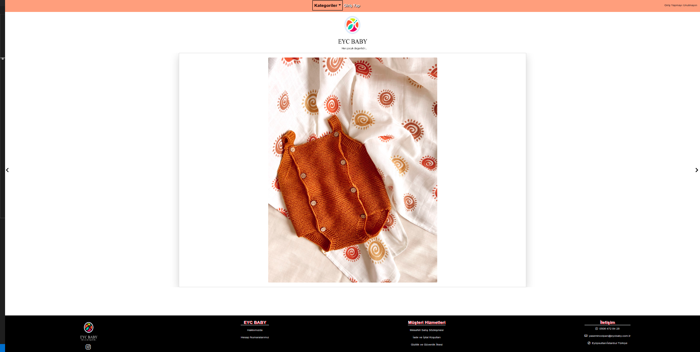

# EYC-Baby Frontend

This is an ongoing project which is an e-commerce app for baby products.

<br>

## Built With

- Javascript
- React
- Redux
- Bootstrap
- Yarn

## Prerequisities

To get this project up and running locally, you must have node installed on your local machine.

## Live Link

- Here is the [live link](https://www.eycbaby.com.tr/)

## Getting Started

**Setup**

- Clone this repository with ```git clone git@github.com:eypsrcnuygr/eyc-frontend-user.git``` using your terminal or command line.<br>
- Change to the project directory by entering ```cd eyc-frontend-user``` in the terminal<br>
- Next run ```yarn``` to install the necessary dependencies<br>
- Run ```yarn start``` to have the necessary changes applied if you want to change anything in the codebase.<br>
- The command above will run the local server.<br>
- Wait for bundle to finish.<br>
- It uses [this](https://github.com/eypsrcnuygr/EYC_API) repo as API. To run your backend server please refer the given link.
- It uses [this](https://github.com/eypsrcnuygr/eyc-frontend-admin) link as content creator admin panel. For more information please refer the link.
- Enjoy!<br>

**Repository Content**

- It uses Redux as a state management system. You can find related folders in the src folder as actions, reducers, store.
- It has two folders as containers and components, for stateful components and dumb components respectively.

## Authors

👤 **Eyüp Sercan UYGUR**

-   Github: [@eypsrcnuygr](https://github.com/eypsrcnuygr)
-   Twitter: [@eypsrcnuygr](https://twitter.com/eypsrcnuygr)
-   LinkedIn: [eypsrcnuygr](https://www.linkedin.com/in/eypsrcnuygr/)
-   Email: [Eyüp Sercan UYGUR](sercanuygur@gmail.com)


## 🤝 Contributing

Contributions, issues and feature requests are welcome!

## Show your support

Give a ⭐️ if you like this project!

## Acknowledgments

-   This Project was part of an assignment of Microverse.
-   Our thanks to Microverse and all our peers and colleagues there.

## 📝 License

This project is [MIT](https://github.com/git/git-scm.com/blob/master/MIT-LICENSE.txt) licensed.
